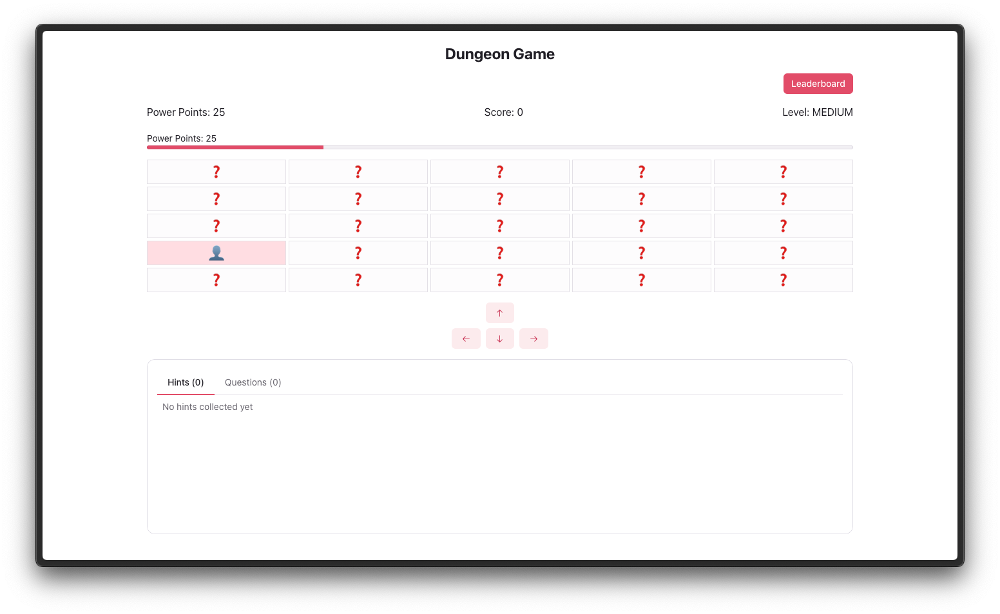

# Dungeon Game

A single-player dungeon adventure game combining exploration with programming challenges. Navigate through dungeons while testing your knowledge of Object-Oriented Programming concepts and design patterns.

[](https://choosealicense.com/licenses/mit/)
[](https://www.oracle.com/java/)
[](https://spring.io/projects/spring-boot)
[](https://reactjs.org/)
[](https://www.mongodb.com/)


Screenshot of UI of the game

## Features

- Multiple difficulty levels with varying map sizes and challenges
- Programming questions focused on OOP concepts and design patterns
- Dynamic dungeon exploration with different room types
- Power points system for game progression
- Inventory system for collecting hints and managing answers
- Leaderboard tracking system for tracking the best players
- Automatic game state persistence

## Quick Start with Docker

The easiest way to run the game is using Docker Compose:

```bash
# Clone the repository
git clone https://github.com/mirislomovmirjalol/dungeon-game.git
cd dungeon-game

# Start all services
docker-compose up --build
```

Access the game at http://localhost:5173

## Manual Setup

### Backend Setup

> Make sure you have Java 17 and Maven installed

Required environment variable:
- `MONGODB_URI` mongodb://localhost:27017/dungeon_game

If you want to use different MongoDB server, you can change the `MONGODB_URI` in the `application.properties` file.

```bash
cd backend

# Install dependencies
mvn clean install

# Run the application
mvn spring-boot:run
```

### Frontend Setup

Required environment variable:
- `VITE_API_URL` (default: http://localhost:8080/api)1

```bash
cd frontend

# Install dependencies (using npm, yarn, or pnpm)
npm install

# Run the development server
npm run dev
```

## API Documentation

The API documentation is available via Swagger UI:
- Swagger UI: http://localhost:8080/swagger-ui.html
- OpenAPI JSON: http://localhost:8080/v3/api-docs

## Development

### Running Tests

Backend tests can be run using Maven:

```bash
cd backend
mvn test
```

## Game Rules

Each difficulty level has different characteristics:

### Easy Level
- 3x3 grid map
- 15 initial power points
- 1 power point per move
- Minimum 2 questions to complete

### Medium Level
- 5x5 grid map
- 25 initial power points
- 2 power points per move
- Minimum 8 questions to complete

### Hard Level
- 10x10 grid map
- 50 initial power points
- 3 power points per move
- Minimum 25 questions to complete